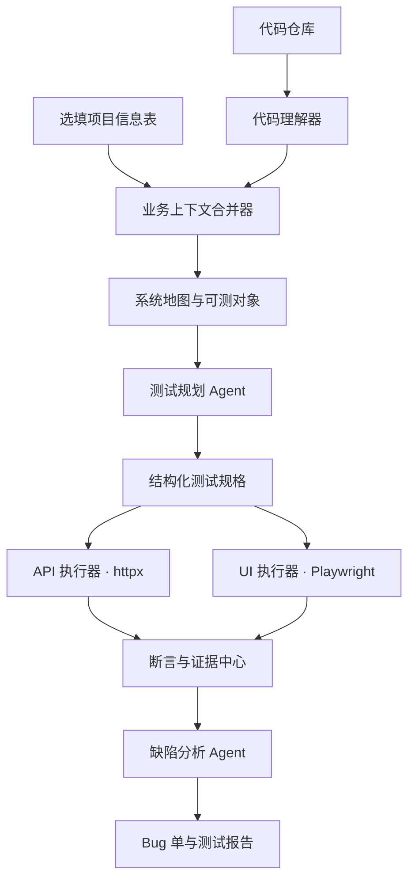

# 通用 AI Debug Agent

> **输入任意代码仓库 + 一份固定格式的选填项目信息表，自动理解业务、生成并执行测试、定位缺陷、输出可复现的 Debug 报告。**

---

## 1. 产品定位

这是一个面向 Web 应用的通用测试与 Debug Agent，不依赖某个固定业务系统。

它以**代码仓库**为主要事实来源，主动识别：

- 技术栈、项目启动方式和依赖；
- 前后端路由、API、数据模型、表单字段；
- 认证、状态管理、输入校验和关键业务流程；
- 可测试页面、接口及其调用关系。

选填表格不是用来替代代码理解，而是补充代码中无法可靠推断的信息，例如业务目标、验收规则、可测试环境和高风险模块。

---

## 2. 输入

### 2.1 必填输入

| 输入 | 内容 | 用途 |
|---|---|---|
| 代码仓库 | 本地目录、Git 仓库压缩包或 Git URL | 理解系统结构与业务实现 |
| 被测环境 | 本地启动命令或测试环境 URL | 启动并访问被测系统 |

### 2.2 固定格式选填表

```yaml
project_name: "Login Register Demo"
business_description: "用户可以注册账号并登录系统"

startup:
  backend: "python app.py"
  frontend: "npm run dev"
  base_url: "http://localhost:3000"

test_scope:
  include:
    - "注册"
    - "登录"
  exclude:
    - "第三方登录"

business_rules:
  - id: "R-REG-001"
    rule: "用户名长度不得少于6位"
  - id: "R-REG-002"
    rule: "重复用户名不得注册成功"

test_accounts:
  prefix: "ai_test_"

reset:
  strategy: "reset_api" # 可选：reset_api / database_file / docker_rebuild / none

risk_focus:
  - "输入校验"
  - "认证与权限"
```

### 2.3 表格设计原则

- 所有字段均可选，未填写时由 Agent 从代码和运行行为推断；
- 已填写的业务规则优先级最高，是自动判定 Bug 的明确依据；
- Agent 会标记“代码可确认”“表格声明”“无法确认”三类结论；
- 环境、域名、可执行命令必须在白名单范围内，禁止误测生产系统。

---

## 3. 核心能力

| 能力 | Agent 的行为 | 产出 |
|---|---|---|
| 代码理解 | 扫描目录、依赖、路由、组件、数据库模型、校验逻辑 | 系统地图 |
| 业务推断 | 从接口名称、表单、调用链和选填规则识别业务流程 | 业务流程图、需求清单 |
| 测试设计 | 生成正常、异常、边界、流程与回归用例 | 结构化测试用例 |
| 接口测试 | 调用 API，验证状态码、响应、数据状态 | API 执行记录 |
| 页面测试 | 用浏览器填写、点击、跳转、截图和断言 | UI 执行记录、截图 |
| 缺陷判定 | 对比需求/业务规则与实际行为，收集证据 | Bug 单 |
| 报告生成 | 汇总覆盖范围、结果、风险与缺陷 | Markdown、HTML 报告 |

---

## 4. 总体架构



### 4.1 代码理解器

负责建立系统地图，而不是直接猜测业务。

| 代码类型 | 识别内容 |
|---|---|
| 后端 | 路由、控制器、请求参数、响应字段、数据库模型、校验与权限 |
| 前端 | 页面路由、表单字段、按钮、接口调用、错误提示、登录态 |
| 配置 | 环境变量、端口、数据库、启动命令、OpenAPI 文档 |
| 测试 | 已有测试、Mock、Fixture、测试数据清理方式 |

### 4.2 业务上下文合并器

将三类信息合并为可测试规则：

1. **代码事实**：例如注册接口接收 `username`、`password`；
2. **运行事实**：例如页面 `/register` 调用 `POST /api/register`；
3. **业务规则**：例如用户名长度必须不少于 6 位。

代码能告诉 Agent“系统做了什么”；业务规则告诉 Agent“系统应该做什么”。两者不一致时，才形成可确认的 Bug。

---

## 5. 执行流程

```text
代码扫描
  → 生成系统地图
  → 合并选填规则
  → 生成测试规格
  → 运行 API 测试
  → 运行页面自动化测试
  → 收集日志、响应和截图
  → 判定缺陷与去重
  → 生成报告 / 推送 Bug
```

### 状态机

```text
DISCOVER → UNDERSTAND → PLAN → EXECUTE_API → EXECUTE_UI
        → ANALYZE → REPORT → DONE
```

若环境不可访问、依赖安装失败或测试数据无法重置，任务进入 `BLOCKED`，报告环境问题，不将其误报为产品 Bug。

---

## 6. 测试生成与执行原则

### 6.1 AI 不直接拥有任意代码执行权限

LLM 生成的是**测试规格**，不是可任意执行的 Shell/Python 脚本：

```json
{
  "id": "TC-REG-002",
  "type": "api_and_ui",
  "preconditions": ["用户名 ai001 未注册"],
  "steps": [
    {"action": "register", "username": "ai001", "password": "Password123"}
  ],
  "expected": {
    "success": false,
    "message_contains": "6"
  },
  "rule_id": "R-REG-001"
}
```

执行器只支持白名单动作，如发已发现的 API、访问已发现页面、填表、点击、读取文本、截图和断言。

### 6.2 代码生成的正确位置

如果需要保留可读的临时测试代码，Agent 可由测试规格渲染出：

- `generated/api/test_registration.py`
- `generated/ui/test_registration.spec.py`

但真正执行应在隔离容器或受限工作目录中进行，且只允许访问配置中的被测环境。

### 6.3 判定优先级

1. 明确填写的业务规则；
2. PRD / OpenAPI / 已有接口契约；
3. 前后端实现的一致性；
4. 安全与通用工程规则；
5. 模型推断的探索性风险（只标为“建议检查”，不直接建高优先级 Bug）。

---

## 7. V1：通用 Debug 闭环

### V1 包含

- 支持 React + Flask 作为首个适配组合；
- 接收任意同类代码仓库和固定格式选填表；
- 静态扫描 Flask 路由、React 路由、Axios/Fetch 调用、表单字段；
- 自动生成系统地图和测试规格；
- `httpx` 接口测试；
- Playwright 页面自动化测试；
- 边界值、异常输入、关键流程测试；
- 请求响应、日志、截图等证据采集；
- 自动生成 Bug JSON、Markdown 和 HTML 报告；
- FastAPI 任务接口。

### V1 不包含

- 不直接修改业务代码或自动修复 Bug；
- 不支持任意语言、任意桌面端/移动端；
- 不接入 Jira、禅道、TAPD；
- 不做 React 管理后台；
- 不做多 Agent 自主循环与复杂重试；
- 不以“模型猜测”替代可执行断言。

---

## 8. 登录注册 Demo 的示例

输入规则：

```yaml
business_rules:
  - id: R-REG-001
    rule: 用户名长度不得少于6位
```

Agent 从代码中识别：

```text
React /register 页面
  → Axios POST /api/register
  → Flask register 路由
  → SQLite users 表
```

Agent 生成边界测试：

| 用例 | 用户名 | 预期 |
|---|---:|---|
| TC-REG-001 | 6 位 | 注册成功 |
| TC-REG-002 | 5 位 | 注册失败，提示长度不足 |
| TC-REG-003 | 7 位 | 注册成功 |

若实际结果为“5 位用户名注册成功”，输出：

```text
BUG-REG-001
标题：用户名长度不足 6 位时仍可注册成功
依据：R-REG-001
证据：API 响应、页面截图、可复现步骤、执行时间
严重程度：Major
```

---

## 9. 项目目录

```text
universal-ai-debug-agent/
├── app/                         # FastAPI 服务
│   ├── main.py
│   ├── routes/tasks.py
│   └── services/task_service.py
├── core/
│   ├── repository_scanner.py    # 目录、依赖、技术栈识别
│   ├── code_analyzer.py         # 路由、组件、调用链提取
│   ├── context_merger.py        # 代码事实与表格规则合并
│   ├── test_planner.py          # LLM 生成结构化测试规格
│   ├── assertion_engine.py
│   ├── bug_triage.py
│   └── report_generator.py
├── executors/
│   ├── api_executor.py          # httpx
│   ├── ui_executor.py           # Playwright
│   └── sandbox.py               # 受限执行环境
├── schemas/
│   ├── project_profile.py
│   ├── system_map.py
│   ├── test_spec.py
│   ├── test_result.py
│   └── bug.py
├── templates/
│   ├── project-profile.yaml
│   └── prompts/
├── projects/                    # 待测试项目副本或挂载目录
├── artifacts/
│   └── task_<id>/
│       ├── system_map.json
│       ├── test_specs.json
│       ├── generated_tests/
│       ├── results.json
│       ├── bugs.json
│       ├── screenshots/
│       ├── report.md
│       └── report.html
└── README.md
```

---

## 10. 最终交付输出

每次任务输出一个独立的 `artifacts/task_<id>/`：

| 文件 | 作用 |
|---|---|
| `system_map.json` | 识别出的技术栈、路由、页面、接口、数据流 |
| `test_specs.json` | AI 生成并校验后的测试规格 |
| `generated_tests/` | 可审阅的临时接口/UI 测试代码 |
| `results.json` | 每个用例的预期、实际、状态与耗时 |
| `screenshots/` | 页面失败证据 |
| `bugs.json` | 标准化缺陷单 |
| `report.md` | 可提交到项目文档的测试报告 |
| `report.html` | 可直接打开查看的测试报告 |

---

## 11. 成功标准

对一个未见过的 React + Flask 项目，Agent 在给定代码仓库与最少环境信息后，能够：

1. 识别系统的启动方式、页面、接口和关键数据流；
2. 根据业务规则自动生成可执行测试；
3. 在 API 与页面两个层面执行测试；
4. 对真实违反规则的行为给出可复现证据；
5. 将“不确定风险”与“已确认 Bug”清楚区分；
6. 输出完整、可审阅、可演示的 Debug 报告。
